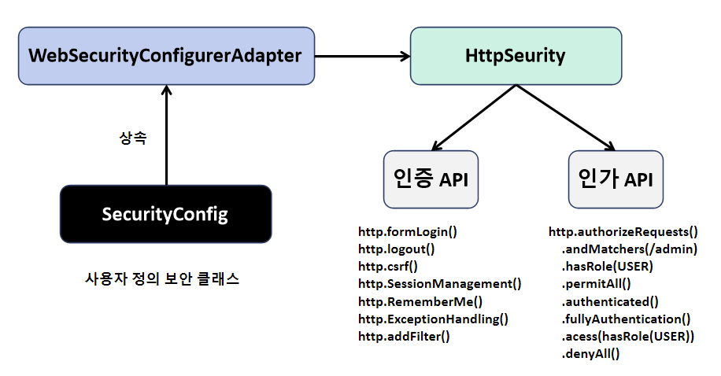
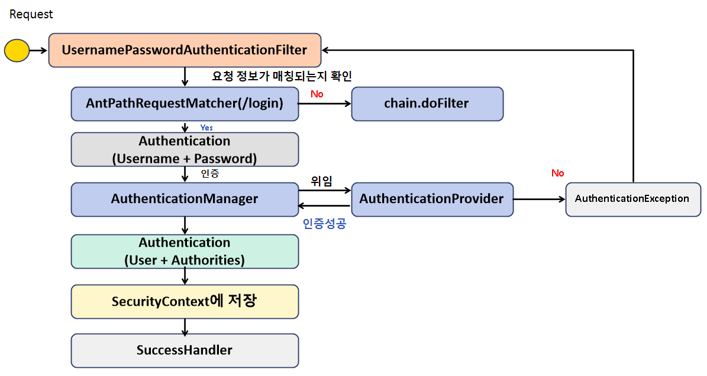
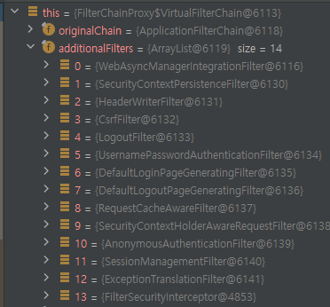
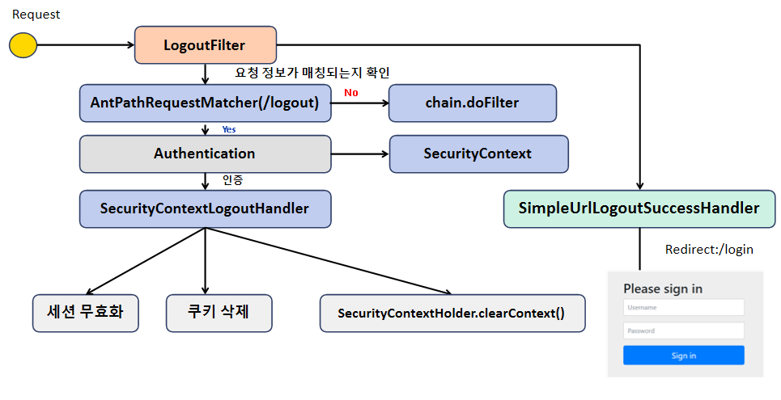
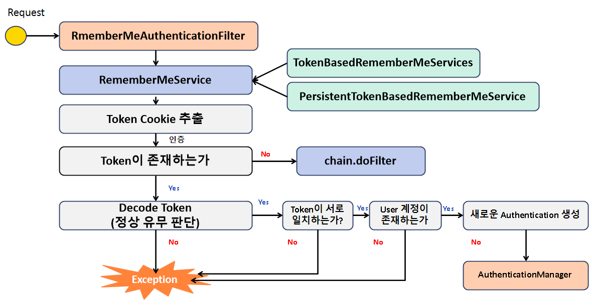
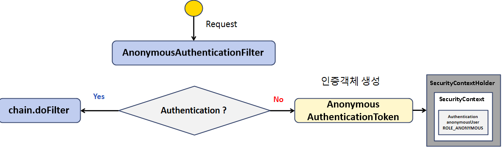

# Spring Security 
### Description
- 회사에 적용된 버전(jdk1.8)을 기준

### Environment
- Spring Boot 2.6.2
- Spring Security 5.6.1
- Gradle

## 인증 API - 사용자 정의 보안 기능 구현



### WebSecurityConfigurerAdapter
- 스프링 시큐리티의 웹 보안 기능 초기화 및 설정

### SecurityConfig
- 사용자 정의 보안 클래스

```java
@Configuration
@EnableWebSecurity
public class SecurityConfig extends WebSecurityConfigurerAdapter {

    @Override
    protected void configure(HttpSecurity http) throws Exception {
        http
            .authorizeRequests()
            .anyRequest().authenticated()
            .and()
            .formLogin();
    }
}
```
- 어노테이션 설명
  - ```@Configuration```
    - Singleton 빈으로 등록하는 과정
    - 내부를 보면 ```Component```어노테이션을 확인할 수 있고, 스프링 컨테이너 빈으로 스캔 됨을 알수 있음
  - ```@EnableWebSecurity```
    - ```WebSecurityConfiguration```
    - ```SpringWebMvcImportSelector```
    - ```HttpSecurityConfiguration```
    - 위의 3개의 클래스를 **IMPORT**
    - 스프링 시큐리티를 활성화하고 웹 보안 설정을 구성하는데 사용
- 작동 원리
  - 스프링 부트가 실행되면서 스프링 시큐리티 관련 클래스를 로드하고, ```WebSecurityConfigurerAdapter```를 수행하면서, Default Security 설정을 바탕으로 보안 활성화
  - ```WebSecurityConfigurerAdapter```를 Override한다. (스프링의 원리가 녹아 있음)
  - 내가 만든 ```WebSecurityConfigurerAdapter```가 수행된다.
  - 건전지 A가 있는데, 건전지 A의 공통 기능은 그대로 수행하면서 세부 구현을 다르게 할 수 있음

### HttpSecurity
- 세부적인 보안 기능을 설정할 수 있는 API 제공
- 인증 API
- 인가 API

## 인증 API - Form Login 인증
```java
@Configuration
@EnableWebSecurity
public class SecurityConfig extends WebSecurityConfigurerAdapter {

  @Override
  protected void configure(HttpSecurity http) throws Exception {
    http
            .authorizeRequests()
            .anyRequest().authenticated()
            .and()
            .formLogin()
            .loginPage("/loginPage")
            .defaultSuccessUrl("/")
            .failureUrl("/login.html?error=true")
            .usernameParameter("userId")
            .passwordParameter("passwd")
            .loginProcessingUrl("/login")
            .successHandler((request, response, authentication) -> {
              System.out.println("authentication : " + authentication.getName());
              response.sendRedirect("/");
            })
            .failureHandler(((request, response, exception) -> {
              System.out.println("exception " + exception.getMessage());
              response.sendRedirect("/login");
            }))
            .permitAll();
  }
}
```
- ```loginPage``` 
  - 사용자 정의 로그인 페이지
- ```defaultSuccessUrl```
  - 로그인 성공 후 이동 페이지
- ```failureUrl```
  - 로그인 실패 후 이동 페이지
- ```usernameParameter```
  - 아이디 파라미터명 설정
- ```passwordParameter```
  - 패스워드 파라미터명 설정
- ```loginProcessingUrl```
  - 로그인 Form Action Url
- ```successHandler```
  - 로그인 성공 후 핸들러
- ```failureHandler```
  - 로그인 실패 후 핸들러

### 아이디 파라미터명 설정, 패스워드 파라미터명 설정 의미
- 스프링 시큐리티가 만들어준 로그인 페이지에서 [아이디, 패스워드]의 기본 설정을 따르지 않고
```html
<div class="container">
      <form class="form-signin" method="post" action="/login_proc">
        <h2 class="form-signin-heading">Please sign in</h2>
        <p>
          <label for="username" class="sr-only">Username</label>
          <input type="text" id="username" name="여기가 바뀜" class="form-control" placeholder="Username" required="" autofocus="">
        </p>
        <p>
          <label for="password" class="sr-only">Password</label>
          <input type="password" id="password" name="여기가 바뀜" class="form-control" placeholder="Password" required="">
        </p>
<input name="_csrf" type="hidden" value="fe30218b-e487-4293-a845-ddd7a975da03">
        <button class="btn btn-lg btn-primary btn-block" type="submit">Sign in</button>
      </form>
</div>
```
- 이런 식으로 사용할 수 있음

### 도식화


- ```UsernamePasswordAuthenticationFitler```
  - 인증처리에 관련된 필터
  - 여러 클래스들을 활용해서 인증처리를 수행

- ```AntPathRequestMatcher```
  - 일치하는 요청(url)이 왔는지 확인
  - 기본 설정은 '/login'으로 되어 있음
  - 매칭 되지 않으면 그 다음 필터로 이동 (chain.doFilter)
  - http.loginProcessingUrl("/login") -> "/login" 바꾸면 변경 가능

- ```Authentication```
  - 사용자가 입력한 username + password 값을 인증 객체에 저장
  - 인증 객체를 생성한다는 의미

- ```AuthenticationManager```
  - 인증 관리자
  - 인증 객체를 넘겨 받고, 인증 처리를 수행
  - 내부적으로 ```AuthenticationProvier```클래스 타입의 객체를 가지고 있음
    - ```AuthenticationManager``` 는 인증 처리를 위임해서 수행
    - 인증에 실패하면 ```AuthenticationException``` 인증 실패 -> 다시 ```UsernamePasswordAuthenticationFilter```가 받아서 예외에 대한 후속 작업 처리
    - 인증에 성공하면 Authentication 객체를 만들어 그 안에 인증에 성공한 User객체 또는 권한정보(Authorization)를 넣어줌
  - ```AuthenticationManager```에게 Return
    - ```AuthenticationManager```는 ```AuthenticationProvider```에게 받은 최종적인 인증 객체를 다시 Filter(```Authentication```)에게 Return

- ```Authentication```
  - 최종적으로 성공한 User객체 + 권한정보(Authorities)

- ```SecurityContext```
  - 여기에 인증 + 인가 정보를 저장
  - Session에도 저장

- ```SuccessHandler```
  - 성공하면 이 핸들러(작업)을 수행

### 실습
#### debug point
- ```UsernamePasswordAuthenticationFilter```
  - ```AbstractAuthenticationProcessingFilter``` 부모 필터의 doFilter 수행
```java
public abstract class AbstractAuthenticationProcessingFilter extends GenericFilterBean implements ApplicationEventPublisherAware, MessageSourceAware {
	private void doFilter(HttpServletRequest request, HttpServletResponse response, FilterChain chain)
			throws IOException, ServletException {
		if (!requiresAuthentication(request, response)) { // 설정한 "/login"과 일치하는지 확인
			chain.doFilter(request, response); // 일치하지 않으면 다음 필터로
			return;
		}
		try {
            // 인증을 수행
			Authentication authenticationResult = attemptAuthentication(request, response);
			if (authenticationResult == null) {
				// return immediately as subclass has indicated that it hasn't completed
				return;
			}
			this.sessionStrategy.onAuthentication(authenticationResult, request, response);
			// Authentication success
			if (this.continueChainBeforeSuccessfulAuthentication) {
				chain.doFilter(request, response);
			}
			successfulAuthentication(request, response, chain, authenticationResult);
		}
		catch (InternalAuthenticationServiceException failed) {
			this.logger.error("An internal error occurred while trying to authenticate the user.", failed);
			unsuccessfulAuthentication(request, response, failed);
		}
		catch (AuthenticationException ex) {
			// Authentication failed
			unsuccessfulAuthentication(request, response, ex);
		}
	}
}
```
  - ```attemptAuthentication```는 ```UsernamePasswordAuthenticationFilter```의 메서드로 수행
```java
public class UsernamePasswordAuthenticationFilter extends AbstractAuthenticationProcessingFilter {

    @Override
    public Authentication attemptAuthentication(HttpServletRequest request,
        HttpServletResponse response)
        throws AuthenticationException {
        if (this.postOnly && !request.getMethod().equals("POST")) { // POST로 왔는지 확인
            throw new AuthenticationServiceException(
                "Authentication method not supported: " + request.getMethod());
        }
        String username = obtainUsername(request); 
        username = (username != null) ? username : "";
        username = username.trim();
        String password = obtainPassword(request);
        password = (password != null) ? password : "";
        UsernamePasswordAuthenticationToken authRequest = new UsernamePasswordAuthenticationToken(
            username, password); // Authentication객체에 username, password를 담아
        // Allow subclasses to set the "details" property
        setDetails(request, authRequest);
        return this.getAuthenticationManager().authenticate(authRequest); // 인증 객체를 AuthenticationManager에 넘김
    }
}
```
```java
public class ProviderManager implements AuthenticationManager, MessageSourceAware, InitializingBean {

    @Override
    public Authentication authenticate(Authentication authentication)
        throws AuthenticationException {
        Class<? extends Authentication> toTest = authentication.getClass();
        AuthenticationException lastException = null;
        AuthenticationException parentException = null;
        Authentication result = null;
        Authentication parentResult = null;
        int currentPosition = 0;
        int size = this.providers.size();
        for (AuthenticationProvider provider : getProviders()) {
            if (!provider.supports(toTest)) {
                continue;
            }
            if (logger.isTraceEnabled()) {
                logger.trace(LogMessage.format("Authenticating request with %s (%d/%d)",
                    provider.getClass().getSimpleName(), ++currentPosition, size));
            }
            try {
                result = provider.authenticate(authentication); // 인증 작업 수행 Provider에게 위임
                if (result != null) {
                    copyDetails(authentication, result);
                    break;
                }
            } catch (AccountStatusException | InternalAuthenticationServiceException ex) {
                prepareException(ex, authentication);
                throw ex;
            } catch (AuthenticationException ex) {
                lastException = ex;
            }
        }
        /* 생략 */
    }
}
```
  - ```AuthenticationProvider```를 상속한 ```AbstractUserDetailsAuthenticationProvider```에서 authenticate진행
```java
public abstract class AbstractUserDetailsAuthenticationProvider
        implements AuthenticationProvider, InitializingBean, MessageSourceAware {

    @Override
    public Authentication authenticate(Authentication authentication)
        throws AuthenticationException {
        Assert.isInstanceOf(UsernamePasswordAuthenticationToken.class, authentication,
            () -> this.messages.getMessage("AbstractUserDetailsAuthenticationProvider.onlySupports",
                "Only UsernamePasswordAuthenticationToken is supported"));
        String username = determineUsername(authentication);
        boolean cacheWasUsed = true;
        UserDetails user = this.userCache.getUserFromCache(username);
        if (user == null) {
            cacheWasUsed = false;
            try {
                user = retrieveUser(username, (UsernamePasswordAuthenticationToken) authentication);
            } catch (UsernameNotFoundException ex) {
                this.logger.debug("Failed to find user '" + username + "'");
                if (!this.hideUserNotFoundExceptions) {
                    throw ex;
                }
                throw new BadCredentialsException(this.messages
                    .getMessage("AbstractUserDetailsAuthenticationProvider.badCredentials",
                        "Bad credentials"));
            }
            Assert.notNull(user,
                "retrieveUser returned null - a violation of the interface contract");
        }
        try {
            this.preAuthenticationChecks.check(user);
            additionalAuthenticationChecks(user,
                (UsernamePasswordAuthenticationToken) authentication);
        } catch (AuthenticationException ex) {
            if (!cacheWasUsed) {
                throw ex;
            }
            // There was a problem, so try again after checking
            // we're using latest data (i.e. not from the cache)
            cacheWasUsed = false;
            user = retrieveUser(username, (UsernamePasswordAuthenticationToken) authentication);
            this.preAuthenticationChecks.check(user);
            additionalAuthenticationChecks(user,
                (UsernamePasswordAuthenticationToken) authentication);
        }
        this.postAuthenticationChecks.check(user);
        if (!cacheWasUsed) {
            this.userCache.putUserInCache(user);
        }
        Object principalToReturn = user;
        if (this.forcePrincipalAsString) {
            principalToReturn = user.getUsername();
        }
        return createSuccessAuthentication(principalToReturn, authentication, user);
    }
}
```
  - ```DaoAuthenticationProvider```의 ```createSuccessAuthentication```호출
  - ```AbstractUserDetailsAuthenticationProvider```을 상속받은 ```DaoAuthenticationProvider```
```java
public abstract class AbstractUserDetailsAuthenticationProvider
        implements AuthenticationProvider, InitializingBean, MessageSourceAware {
  protected Authentication createSuccessAuthentication(Object principal, Authentication authentication,
          UserDetails user) {
    UsernamePasswordAuthenticationToken result = new UsernamePasswordAuthenticationToken(principal,
            authentication.getCredentials(), this.authoritiesMapper.mapAuthorities(user.getAuthorities()));
    result.setDetails(authentication.getDetails());
    this.logger.debug("Authenticated user");
    return result;
  }
}
```

  - 다시 ```AbstractAuthenticationProcessingFilter```로 와서
```java
    Authentication authenticationResult = attemptAuthentication(request, response);
```
  - 를 반환받고(인증, 인가정보가 담긴 객체)
  - ```successfulAuthentication```을 호출

```java
public abstract class AbstractAuthenticationProcessingFilter extends GenericFilterBean
        implements ApplicationEventPublisherAware, MessageSourceAware {

    protected void successfulAuthentication(HttpServletRequest request,
        HttpServletResponse response, FilterChain chain,
        Authentication authResult) throws IOException, ServletException {
        SecurityContext context = SecurityContextHolder.createEmptyContext();
        context.setAuthentication(authResult);
        SecurityContextHolder.setContext(context);
        if (this.logger.isDebugEnabled()) {
            this.logger.debug(LogMessage.format("Set SecurityContextHolder to %s", authResult));
        }
        this.rememberMeServices.loginSuccess(request, response, authResult);
        if (this.eventPublisher != null) {
            this.eventPublisher.publishEvent(
                new InteractiveAuthenticationSuccessEvent(authResult, this.getClass()));
        }
        this.successHandler.onAuthenticationSuccess(request, response, authResult);
    }
}
```
  - ```onAuthenticationSuccess```를 호출
```java
public interface AuthenticationSuccessHandler {

    default void onAuthenticationSuccess(HttpServletRequest request, HttpServletResponse response,
        FilterChain chain,
        Authentication authentication) throws IOException, ServletException {
        onAuthenticationSuccess(request, response, authentication);
        chain.doFilter(request, response);
    }
}
```

### FilterChainProxy
- FilterChainProxy의 등록된 각각의 필터들



```java
public class FilterChainProxy extends GenericFilterBean {
  private static final class VirtualFilterChain implements FilterChain {
    @Override
    public void doFilter(ServletRequest request, ServletResponse response) throws IOException, ServletException {
      /* 생략 */  
      Filter nextFilter = this.additionalFilters.get(this.currentPosition - 1);
      nextFilter.doFilter(request, response, this); // 디버깅 포인트
    }
  }
}
```

## 인증 API - Logout

```java
        http.logout()
            .logoutUrl("/logout")
            .logoutSuccessUrl("/login")
            .deleteCookies("JSESSIONID", "remember-me")
            .addLogoutHandler((request, response, authentication) -> {
                HttpSession session = request.getSession();
                session.invalidate();
            })
            .logoutSuccessHandler(
                (request, response, authentication) -> response.sendRedirect("/login"));
```
- ```http.logout()```
  - 로그아웃 기능이 작동함
- ```logoutUrl ```
  - 로그아웃 처리 URL
- ```logoutSuccessUrl```
  - 로그아웃 성공 후 이동페이지
- ```deleteCookies("JSESSIONID", "remember-me")```
  - 로그아웃 후 쿠키 삭제
- ```addLogoutHandler(logoutHandler())```
  - 로그아웃 핸들러
  - 기본적으로 스프링 시큐리티가 로그아웃 시 제공하는 구현체가 있음
  - 세션 삭제, 인증 토큰 삭제(기본 제공)
  - 그 외로 로그아웃이 이루어 졌을 때, 추가적으로 하고 싶은 작업이 있을 경우 커스텀해서 사용
- ```logoutSuccessHandler(logoutSuccessHandler())```
  - 로그아웃 성공 후 핸들러
  - 로그아웃이 성공적으로 수행된 후 실행될 핸들러
### 도식화


- ```LogoutFilter```
  - 요청을 받아서 기본 설정 -> POST
  - ```AntPathRequestMatcher```에게 넘김
- ```AntPathRequestMatcher```
  - "/설정한 URL"로 요청이 왔는지 확인
  - URL과 일치하지 않으면, 다음 필터로 넘어가면서 로그아웃에 실패
- ```Authentication```
  - ```SecurityContext```의 인증 객체를 가지고 와서 ```LogoutHandler```에게 넘김
- ```SecurityContextLogoutHandler```
  - ```LogoutHandler``` 구현체
  - 세션을 무효화
  - 쿠키 삭제
  - SecurityContextHolder.clearContext() -> 인증 객체(Authentication) 삭제
- ```SimpleUrlLogoutSuccessHandler```
  - 로그아웃에 성공한 ```LogoutFilter```는 ```SimpleUrlLogoutSuccessHandler```를 호출한다.
  - 로그인 페이지로 redirect

## 인증 API - Remember Me 인증
1. 세션이 만료되고 웹 브라우저가 종료된 후에도 어플리케이션이 사용자를 기억하는 기능
2. Remember-Me 쿠키에 대한 Http 요청을 확인한 후 토큰 기반 인증을 사용해 유효성을 검사하고 토큰이 검증되면 사용자는 로그인된다.
3. 사용자 라이프 사이클
   - 인증 성공(Remember-Me쿠키 설정)
   - 인증 실패(쿠키가 존재하면 쿠키 무효화)
   - 로그아웃(쿠키가 존재하면 쿠키 무효화)

```java
        http.rememberMe()
            .rememberMeParameter("remember")
            .tokenValiditySeconds(3600)
            .alwaysRemember(true) 
            .userDetailsService(userDetailsService);
```

- ```rememberMe()```
  - rememberMe 기능 활성화
- ```rememberMeParameter("remember")```
  - 기본 파라미터명은 remember-me
- ```totkenValiditySeconds(3600)```
  - default는 14일
- ```userDetailsService```
  - 시스템에 있는 사용자 계정을 조회하는 처리과정에 필요한 클래스 등록


### RememberMeAuthenticationFilter


- ```RememberMeAuthenticationFilter```
  - SecurityContext의 인증 객체가 없는 경우 작동
  - Session이 만료, 비활성화 되었을 경우 -> rememberMeToken을 가져오는 경우 작동
- ```RmemeberMeServices```
  - 두개의 구현체
    - ```TokenBasedRememberMeServices```
      - 메모리에서 토큰을 저장한 것과 사용자가 요청을 할 때 가지고 온 쿠키(토큰)과 비교해서 인증 처리
      - 기본 14일 만료 기간
    - ```PersistentTokenBasedRememberMeServices```
      - DB에 서비스에서 발급할 토큰을 저장하고
      - 그 토큰을 클라이언트에서 가지고 온 쿠키(토큰)과 비교해서 인증 처리
  - Token Cookie를 추출
  - Token이 존재할 경우
  - Decode Token -> 정상 유무를 판단
    - 정상이 아닐 경우 예외
  - 토큰의 값이 일치하는지 확인
    - 일치하지 않을 경우 예외
  - User 계정이 존재하는지 확인
    - DB에 저장된 유저를 조회해서, 존재하게 되면 다음 단계로
  - 새로운 ```Authentication``` 생성
  - ```AuthenticationManager```에게 인증객체를 넘겨주면서 인증 처리

### RememberMeAuthenticationFilter 요약
1. 이 필터는 rememberMe 기능을 체크했을 때 타게된다.
2. 세션안에 SecurityContext가 존재하는 것
3. 세션이 만료되었을 경우 rememberMeToken을 이용해서 인증을 수행
4. 어찌보면, JWT의 refreshToken과 유사한 점이 있음


## AnonymousAuthenticationFilter


- 익명사용자 인증 처리 필터
- 익명사용자와 인증 사용자를 구분해서 처리하기 위한 용도로 사용
- 화면에서 인증 여부를 구현할 때 isAnonymous()와 isAuthenticated() 로 구분해서 사용
  - isAnonymous() = true -> 로그인 페이지 보여줌
  - isAuthentication() = true -> 로그아웃 표시
- 인증객체를 세션에 저장하지 않는다.